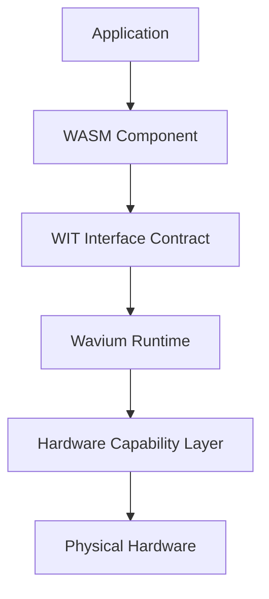
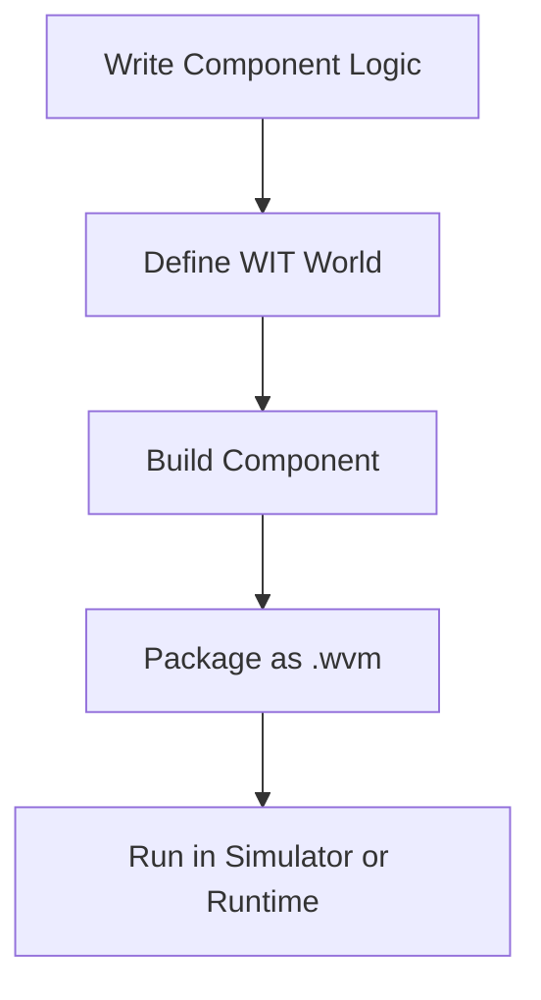
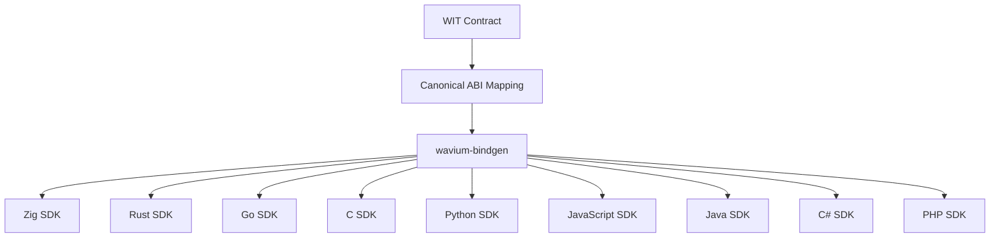

<div align="center">
    
</div>
# Wavium

[](build.zig.zon)
[](LICENSE)
[](docs/README.md)
[](.github/workflows/ci.yml)


Wavium is a Zig-based, bare-metal WebAssembly execution platform for running portable WebAssembly Components directly on hardware.

It is designed as infrastructure rather than an application framework. The stable boundary is the WebAssembly Component Model, the contract surface is WIT, and the execution substrate is a capability-secured runtime that can boot on bare metal, simulate in CI, and scale across hardware classes.

## System Model




Traditional systems usually follow the path:

Application -> Libraries -> Operating System -> Kernel -> Hardware

Wavium follows a component-native model:

Application -> WASM Component -> WIT Contract -> Wavium Runtime -> Hardware

This architecture is intended to improve:
- portability across languages and targets
- security through explicit capability boundaries
- scalability through portable component packaging
- performance through bare-metal execution and deterministic runtime control
- polyglot development through generated SDKs

## Documentation

Primary documentation lives under [docs](docs):
- [Vision](docs/vision/project-vision.md)
- [Architecture](docs/architecture/overview.md)
- [Runtime](docs/runtime/wavium-core.md)
- [Hardware](docs/hardware/bootloader.md)
- [Toolchain](docs/toolchain/cli.md)
- [Developers](docs/developers/getting-started.md)
- [Specifications](docs/specifications/wavium-runtime-spec.md)
- [Tutorials](docs/tutorials/hello-world.md)
- [Reference](docs/reference/command-reference.md)
- [ADRs](docs/adr/001-why-zig.md)
- [WCOE Index](docs/wcoe/README.md)

Supporting project docs:
- [docs/README.md](docs/README.md)
- [CONTRIBUTING.md](CONTRIBUTING.md)
- [SECURITY.md](SECURITY.md)
- [ROADMAP.md](ROADMAP.md)
- [CHANGELOG.md](CHANGELOG.md)

## Release & Versioning

Wavium uses semantic versioning for the repository and published artifacts.

- Current root version: 0.1.0
- The root package version is defined in [build.zig.zon](build.zig.zon)
- SDK scaffolds track the same baseline version across language targets
- Release notes are recorded in [CHANGELOG.md](CHANGELOG.md)
- Release policy and channel definitions are tracked in [release-config.yml](release-config.yml)
- The release workflow scaffold lives in [`.github/workflows/release.yml`](.github/workflows/release.yml)

Release tracks:
- stable: tagged releases intended for general consumption
- nightly: pre-release or in-progress builds used for validation and internal testing

Versioning rules:
- patch releases fix bugs or documentation issues without contract changes
- minor releases add backward-compatible features
- major releases may change contracts, packaging, or runtime assumptions

## Repository Workflow

Scripts:
- [scripts/test.sh](scripts/test.sh) and [scripts/test.ps1](scripts/test.ps1)
- [scripts/build.sh](scripts/build.sh) and [scripts/build.ps1](scripts/build.ps1)
- [scripts/sdk-status.sh](scripts/sdk-status.sh) and [scripts/sdk-status.ps1](scripts/sdk-status.ps1)
- [scripts/ci.sh](scripts/ci.sh) and [scripts/ci.ps1](scripts/ci.ps1)

CI workflows:
- [`.github/workflows/ci.yml`](.github/workflows/ci.yml)
- [`.github/workflows/build.yml`](.github/workflows/build.yml)
- [`.github/workflows/test.yml`](.github/workflows/test.yml)
- [`.github/workflows/benchmark.yml`](.github/workflows/benchmark.yml)
- [`.github/workflows/security.yml`](.github/workflows/security.yml)

## Examples

The [examples](examples) directory contains scenario-driven samples for:
- hello-component
- actor-supervision
- binary-rpc-replacement
- edge-device-sensor
- gpu-exec
- ai-agent-component

## Build Your First Application

Wavium applications are written as WebAssembly Components with a WIT contract. The fastest path from zero to a running component looks like this:



1. **Write the component logic.** Keep the first version small and side-effect free:

    ```zig
    const std = @import("std");

    pub fn greet() []const u8 {
        return "hello from wavium";
    }

    test "greet returns a stable message" {
        try std.testing.expectEqualStrings("hello from wavium", greet());
    }
    ```

2. **Define the WIT world.** This is the contract the runtime validates before executing anything:

    ```wit
    package wavium:hello;

    world hello-component {
        export greet: func() -> string;
    }
    ```

3. **Build and validate** with the workspace scripts:

    ```sh
    sh scripts/build.sh
    sh scripts/test.sh
    ```

4. **Package and run** the component through the toolchain described in [docs/toolchain/cli.md](docs/toolchain/cli.md) and [docs/toolchain/package-format.md](docs/toolchain/package-format.md).

5. **Pick a language SDK** from [sdks](sdks) if you want a polyglot client instead of raw WIT bindings.

### Where To Go Next

- [Hello World Tutorial](docs/tutorials/hello-world.md): the same walkthrough with full explanations.
- [First Component Tutorial](docs/tutorials/first-component.md): a step-by-step build of a slightly more realistic component.
- [Actor Example Tutorial](docs/tutorials/actor-example.md): building concurrent, supervised components.
- [Hardware Example Tutorial](docs/tutorials/hardware-example.md): acquiring and using hardware capabilities safely.
- [Create a Component](docs/developers/create-component.md) and [Write a WIT Interface](docs/developers/write-wit-interface.md) for the underlying rules.
- [examples](examples): full working sources for every scenario above, ready to copy and adapt.

## Language SDKs

Wavium components are language-neutral at the contract level: every SDK below is generated from the same WIT and canonical ABI definitions, so application code written against one SDK maps onto the same runtime capability model as any other. The shared registry that keeps this mapping canonical lives in [modules/wavium-sdk/src/lib.zig](modules/wavium-sdk/src/lib.zig).

| Language | Package | Directory | Entry Point | Version | Status |
|---|---|---|---|---|---|
| Zig | `wavium-zig-sdk` | [sdks/wavium-zig-sdk](sdks/wavium-zig-sdk) | [src/lib.zig](sdks/wavium-zig-sdk/src/lib.zig) | 0.1.0 | Implemented |
| Rust | `wavium-rust-sdk` | [sdks/wavium-rust-sdk](sdks/wavium-rust-sdk) | [src/lib.rs](sdks/wavium-rust-sdk/src/lib.rs) | 0.1.0 | Implemented |
| Go | `wavium-go-sdk` | [sdks/wavium-go-sdk](sdks/wavium-go-sdk) | [wavium.go](sdks/wavium-go-sdk/wavium.go) | 0.1.0 | Implemented |
| C | `wavium-c-sdk` | [sdks/wavium-c-sdk](sdks/wavium-c-sdk) | [include/wavium.h](sdks/wavium-c-sdk/include/wavium.h) | 0.1.0 | Implemented |
| Python | `wavium-python-sdk` | [sdks/wavium-python-sdk](sdks/wavium-python-sdk) | [src/wavium_sdk/\_\_init\_\_.py](sdks/wavium-python-sdk/src/wavium_sdk/__init__.py) | 0.1.0 | Implemented |
| JavaScript | `wavium-js-sdk` | [sdks/wavium-js-sdk](sdks/wavium-js-sdk) | [index.js](sdks/wavium-js-sdk/index.js) | 0.1.0 | Implemented |
| Java | `wavium-java-sdk` | [sdks/wavium-java-sdk](sdks/wavium-java-sdk) | [Wavium.java](sdks/wavium-java-sdk/src/main/java/io/wavium/sdk/Wavium.java) | 0.1.0 | Implemented |
| C# | `wavium-csharp-sdk` | [sdks/wavium-csharp-sdk](sdks/wavium-csharp-sdk) | [Wavium.cs](sdks/wavium-csharp-sdk/src/Wavium.cs) | 0.1.0 | Implemented |
| PHP | `wavium-php-sdk` | [sdks/wavium-php-sdk](sdks/wavium-php-sdk) | [Wavium.php](sdks/wavium-php-sdk/src/Wavium.php) | 0.1.0 | Implemented |

Every SDK implements the same canonical ABI codec (`i32`, `bool`, length-prefixed `string`) and the same `CapabilityHandle` concept as the runtime, and ships with a test suite that runs with only that language's own toolchain — no external test framework required.

### How SDKs Are Generated

Every SDK is derived from the same source of truth rather than hand-maintained per language:



1. A component's public surface is described once in WIT.
2. `wavium-bindgen` maps WIT types to the canonical ABI (see [docs/architecture/wit-model.md](docs/architecture/wit-model.md)).
3. Each target language gets generated bindings plus room for small handwritten adapters around capability handles.
4. The [modules/wavium-sdk](modules/wavium-sdk) registry keeps package names and directory locations consistent across languages, so tooling and CI can enumerate SDKs programmatically instead of hardcoding paths.

### Choosing an SDK

- Use the **Zig SDK** when building components, drivers, or runtime-adjacent tooling that should compile alongside the core platform.
- Use the **Rust** or **C** SDKs for systems-level client code that needs precise control over memory and capability handles.
- Use **Go**, **Python**, **JavaScript**, **Java**, **C#**, or **PHP** for operational tooling, orchestration scripts, or application-layer clients that talk to Wavium components without needing bare-metal control.
- All SDKs expose the same capability model: resource access always goes through explicit capability handles, never ambient APIs, regardless of language.

### SDK Status

Every SDK ships with a real, tested canonical ABI implementation: package metadata, an entry-point module with `CapabilityHandle` and `i32`/`bool`/`string` codecs, and a test suite runnable with only that language's own toolchain (`zig test`, `cargo test`, `go test`, `zig cc` + the compiled binary, `python -m unittest`, `node --test`, `javac`/`java`, `dotnet run`, and `php`, respectively). As `wavium-bindgen` gains full multi-language code generation from WIT, these handwritten codecs will be joined by generated bindings while preserving each SDK's existing package name, directory, and public entry point. Track progress in [docs/toolchain/sdk-generation.md](docs/toolchain/sdk-generation.md) and [CHANGELOG.md](CHANGELOG.md).

## Quick Start

1. Read the architecture docs in [docs](docs).
2. Run the workspace CI wrapper:

```sh
sh scripts/ci.sh
```

3. Review the SDK scaffolds under [sdks](sdks).
4. Make changes with tests and documentation updates together.

## Repository Layout

- [modules](modules): runtime, hardware, toolchain, and subsystem modules
- [sdks](sdks): implemented language SDKs with shared canonical ABI codecs
- [docs](docs): architecture, runtime, hardware, toolchain, developer, tutorial, and reference documentation
- [specs](specs): WAS v0.1 architecture contracts and invariants
- [tests](tests): component and integration tests
- [scripts](scripts): workspace automation wrappers
- [.github](.github): CI workflows and contribution templates

## Project Status

Implemented and test-validated foundations:
- runtime lifecycle and service registry primitives
- deterministic memory arena and quota primitives
- cooperative scheduler task execution path
- capability token authorization model
- WASM engine lifecycle contracts
- component load/link contracts with WIT world matching
- WIT parsing, canonical ABI mapping, and primitive codecs
- WASI host context with capability-gated storage access
- security revocation manager and resource-handle permission checks
- build/package/verify contracts and `.wvm` manifest serialization
- signing, verification, and trust registry gates
- bindgen stubs and canonical ABI helper scaffolds
- component tool lifecycle contracts
- deploy/update/rollback/migrate trust-gated package admission
- repository scripts and GitHub Actions workflow set
- implemented canonical ABI SDKs for Zig, Rust, Go, C, Python, JavaScript, Java, C#, and PHP

## License

Wavium is intended to be released under [Apache License 2.0](LICENSE).

Apache 2.0 is a strong fit for infrastructure software because it supports broad adoption, includes an explicit patent grant, and aligns with the governance model used by major open-source systems projects.

## Contributing

See [CONTRIBUTING.md](CONTRIBUTING.md) for the contribution workflow, testing requirements, and review expectations.

## Roadmap

See [ROADMAP.md](ROADMAP.md) for near-term and longer-term project direction.

## Security

See [SECURITY.md](SECURITY.md) for vulnerability reporting and threat-model expectations.
