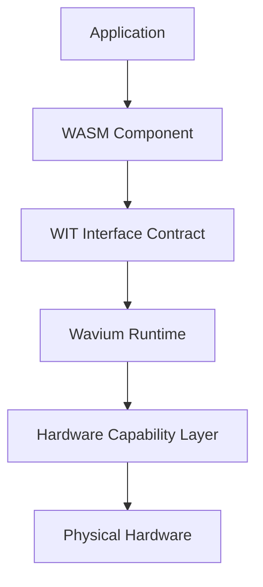

# Wavium

Wavium is the Universal WebAssembly Execution Fabric: a Zig-based, bare-metal computing platform for running portable WebAssembly Components directly on hardware.

It is designed as infrastructure, not as an application framework. The stable boundary is the component model, the contract surface is WIT, and the execution substrate is a capability-secured runtime that can boot on bare metal, simulate in CI, and scale across hardware classes.

## Architecture



Traditional model:

Application -> Libraries -> Operating System -> Kernel -> Hardware

Wavium model:

Application -> WASM Component -> WIT Contract -> Wavium Runtime -> Hardware

This model improves:
- portability across languages and targets
- security through explicit capability boundaries
- scalability through portable component packaging
- performance through bare-metal execution and deterministic runtime control
- polyglot development through generated SDKs

## Documentation Portal

Primary documentation lives under [docs](docs):
- [Vision](docs/vision/project-vision.md)
- [Architecture](docs/architecture/overview.md)
- [Runtime](docs/runtime/wavium-core.md)
- [Hardware](docs/hardware/bootloader.md)
- [Toolchain](docs/toolchain/cli.md)
- [Developers](docs/developers/getting-started.md)
- [Specifications](docs/specifications/wavium-runtime-spec.md)
- [Tutorials](docs/tutorials/hello-world.md)
- [Reference](docs/reference/command-reference.md)
- [ADRs](docs/adr/001-why-zig.md)

Supporting docs and process files:
- [docs/README.md](docs/README.md)
- [CONTRIBUTING.md](CONTRIBUTING.md)
- [SECURITY.md](SECURITY.md)
- [ROADMAP.md](ROADMAP.md)
- [CHANGELOG.md](CHANGELOG.md)

## Repository Workflow

Scripts:
- [scripts/test.sh](scripts/test.sh) and [scripts/test.ps1](scripts/test.ps1)
- [scripts/build.sh](scripts/build.sh) and [scripts/build.ps1](scripts/build.ps1)
- [scripts/sdk-status.sh](scripts/sdk-status.sh) and [scripts/sdk-status.ps1](scripts/sdk-status.ps1)
- [scripts/ci.sh](scripts/ci.sh) and [scripts/ci.ps1](scripts/ci.ps1)

CI:
- [`.github/workflows/ci.yml`](.github/workflows/ci.yml)
- [`.github/workflows/build.yml`](.github/workflows/build.yml)
- [`.github/workflows/test.yml`](.github/workflows/test.yml)
- [`.github/workflows/benchmark.yml`](.github/workflows/benchmark.yml)
- [`.github/workflows/security.yml`](.github/workflows/security.yml)

## Examples

The [examples](examples) directory contains scenario-driven samples for:
- hello-component
- actor-supervision
- binary-rpc-replacement
- edge-device-sensor
- gpu-exec
- ai-agent-component

## Quick Start

1. Read the architecture docs in [docs](docs).
2. Run the workspace CI wrapper:

```sh
sh scripts/ci.sh
```

3. Review the SDK scaffolds under [sdks](sdks).
4. Make changes with tests and documentation updates together.

## Repository Layout

- [modules](modules): runtime, hardware, toolchain, and subsystem modules
- [sdks](sdks): generated-language SDK scaffolds
- [docs](docs): architecture, runtime, hardware, toolchain, and developer documentation
- [specs](specs): WAS v0.1 architecture contracts and invariants
- [tests](tests): component and integration tests
- [scripts](scripts): workspace automation wrappers
- [.github](.github): CI workflows and contribution templates

## Current Status

Implemented and test-validated foundations:
- runtime lifecycle and service registry primitives
- deterministic memory arena and quota primitives
- cooperative scheduler task execution path
- capability token authorization model
- WASM engine lifecycle contracts
- component load/link contracts with WIT world matching
- WIT parsing, canonical ABI mapping, and primitive codecs
- WASI host context with capability-gated storage access
- security revocation manager and resource-handle permission checks
- build/package/verify contracts and `.wvm` manifest serialization
- signing, verification, and trust registry gates
- bindgen stubs and canonical ABI helper scaffolds
- component tool lifecycle contracts
- deploy/update/rollback/migrate trust-gated package admission
- hardware-first, boot-framework, and logo-generation prompt packs
- repository scripts and GitHub Actions workflow set
- SDK scaffolds for Zig, Rust, Go, C, Python, and JavaScript

## License

Wavium is intended to be released under [Apache License 2.0](LICENSE).

Apache 2.0 is the recommended license for this project because it is a strong fit for infrastructure software: it supports broad adoption, includes an explicit patent grant, and matches the governance model used by major open-source systems projects.

## Contributing

See [CONTRIBUTING.md](CONTRIBUTING.md) for the contribution workflow, testing requirements, and review expectations.

## Roadmap

See [ROADMAP.md](ROADMAP.md) for near-term and longer-term project direction.

## Security

See [SECURITY.md](SECURITY.md) for vulnerability reporting and threat-model expectations.
