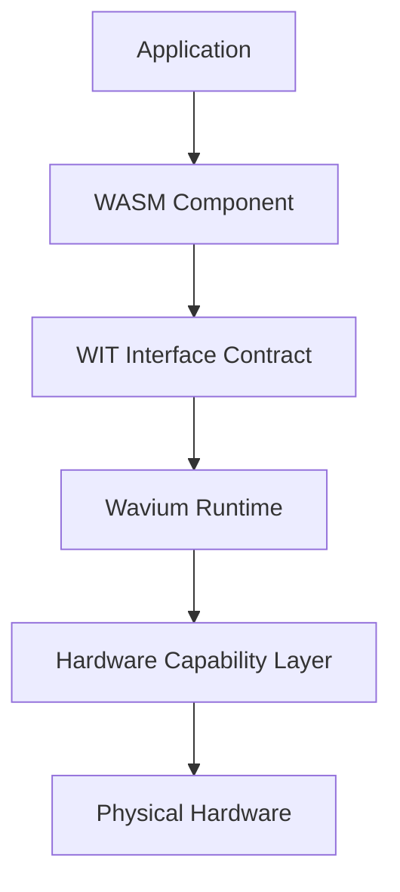

# Wavium Documentation Portal

Wavium documentation is organized as a technical reference set rather than a marketing README.

## Purpose

This portal is the entry point for architecture decisions, subsystem descriptions, tutorials, API references, and contributor guidance. It is intended to be read by maintainers, integrators, hardware vendors, and contributors who need a precise model of the platform.

## Navigation

- [Vision](vision/project-vision.md)
- [Architecture](architecture/overview.md)
- [Runtime](runtime/wavium-core.md)
- [Hardware](hardware/bootloader.md)
- [Toolchain](toolchain/cli.md)
- [Developers](developers/getting-started.md)
- [Specifications](specifications/wavium-runtime-spec.md)
- [Tutorials](tutorials/hello-world.md)
- [Reference](reference/command-reference.md)
- [ADRs](adr/001-why-zig.md)
- [WCOE Index](wcoe/README.md)

## Documentation Standard

Every page should state:
- its scope
- the subsystem it describes
- the invariants it relies on
- the related docs that define its dependencies
- the implementation artifacts that realize it

## Primary System Model

## Reading Order

1. Read [Project Vision](vision/project-vision.md) to understand the platform goals.
2. Read [Architecture Overview](architecture/overview.md) to understand the layer model.
3. Read [Wavium Runtime Spec](specifications/wavium-runtime-spec.md) for invariants.
4. Read [Getting Started](developers/getting-started.md) before contributing code.

## Maintainer Note

When a subsystem changes, update its implementation, its spec, and any tutorial or reference page that teaches it.

## Site Build

The documentation portal is configured through [mkdocs.yml](../mkdocs.yml) and uses text-based diagram sources under [docs/images](images).
