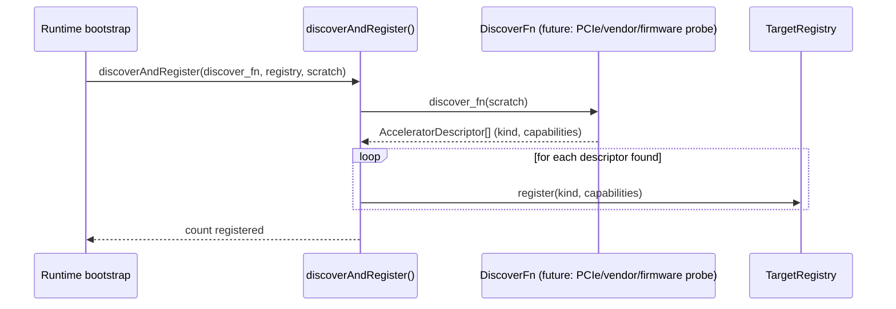

# Accelerator discovery

> Part of the Prompt 30 deliverable ("Future many-core heterogeneous
> architecture"). Implementation: [`modules/wavium-heterogeneous/src/discovery.zig`](../../modules/wavium-heterogeneous/src/discovery.zig).

## Problem

Before the runtime can schedule work onto a GPU, NPU, DPU, SmartNIC,
FPGA, AI accelerator, or TPU, it must first learn that the device
exists and what it can do. On real hardware this involves
device-specific mechanisms - PCIe capability scanning, vendor driver
enumeration APIs, firmware queries over a management interface,
device-tree parsing on embedded boards, and so on - none of which
Wavium implements yet (see the module README's "do not implement
hardware-specific code" constraint).

## Approach: the `DiscoverFn` seam

Discovery is decoupled from any specific bus or vendor protocol via a
single function-pointer seam:

```zig
pub const DiscoverFn = *const fn (out: []AcceleratorDescriptor) usize;
```

A concrete backend (a PCIe scanner, an NPU vendor SDK wrapper, a
SmartNIC firmware query, a device-tree walker for embedded targets)
implements this function: it fills `out` with `AcceleratorDescriptor{kind, capabilities}`
entries and returns how many it found. `discoverAndRegister()` then
folds every discovered accelerator into the shared `TargetRegistry` as
an `ExecutionTarget`, after which it is visible to
`capability_mapping.selectTarget()` exactly like any other target.

This is the same seam pattern already used elsewhere in the runtime:

- `wavium-topology`'s `ArchProbe`/`ProbeFn` (Prompt 26) probes CPU
  topology (cores, cache levels, NUMA nodes) without hardcoding any
  particular CPU vendor's detection mechanism.
- `wavium-hal`'s `DriverLifecycle` seam attaches/detaches drivers
  without the HAL knowing the driver's internals.
- `wavium-dist-services`' `SyncFn` (Prompt 28) performs cross-node
  synchronization without the distributed-services layer knowing the
  transport.

## Discovery flow



## Testing without hardware

Because discovery is a pure function pointer, tests exercise it with
deterministic stubs (`stubDiscoverNone`, `stubDiscoverOneGpu` in
`discovery.zig`) that behave exactly like a real backend would, minus
any actual hardware access - the registration and error-handling logic
(`DiscoveryError.RegistryFull` when the registry is full) is fully
verified without needing a GPU/NPU/etc. present.

## Future extension points

- Multiple `DiscoverFn`s could be composed (one per bus/vendor) and
  run in sequence during boot.
- Hot-plug discovery (a SmartNIC appearing at runtime) can reuse the
  same `discoverAndRegister()` entry point outside of boot.
- Re-discovery after a target reports `available = false` (see
  [execution-migration.md](execution-migration.md)) could trigger a
  fresh probe to find a replacement.
