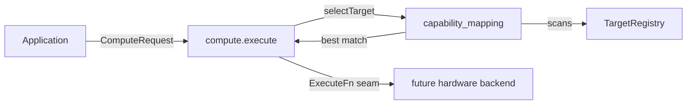

# Capability mapping

> Part of the Prompt 30 deliverable ("Future many-core heterogeneous
> architecture"). Implementation: [`modules/wavium-heterogeneous/src/capability_mapping.zig`](../../modules/wavium-heterogeneous/src/capability_mapping.zig).

## Problem

"Applications request capabilities, not devices." Capability mapping
is the mechanism that turns an application's abstract request (e.g.
"I need `tensor_ops`") into a concrete, available `ExecutionTarget`
without the application ever naming a device kind.

## Vocabulary

- **`ComputeCapability`** ([`capability.zig`](../../modules/wavium-heterogeneous/src/capability.zig)):
  8 capability kinds an application can ask for -
  `general_purpose`, `simd_parallel`, `tensor_ops`,
  `packet_processing`, `low_latency`, `energy_efficient`,
  `high_throughput`, `reconfigurable_logic`.
- **`CapabilitySet`**: a `std.EnumSet(ComputeCapability)` - a target
  can advertise any combination (a GPU might advertise both
  `simd_parallel` and `high_throughput`; an FPGA might advertise
  `reconfigurable_logic` and `low_latency`).
- **`ComputeRequest{required: CapabilitySet}`**: what an application
  submits to `compute.execute()`.

## Matching algorithm

`scoreTarget(target, required)`:

1. Unavailable targets (`target.available == false`) score `0`
   unconditionally.
2. If `required` is **not** a subset of `target.capabilities`, score
   `0` - this is a **hard requirement**, not a best-effort match. A
   target missing even one requested capability is never selected,
   avoiding silent functional degradation (e.g. never running a
   `tensor_ops` request on a target that can't do tensor ops).
3. Otherwise, score = `required.count()` - constant across all
   qualifying targets today, but leaves room for future refinement
   (e.g. weighting by how *many* extra capabilities a target has, or
   by current load) without changing the contract.

`selectTarget(registry, request)` scans every registered target,
keeps the highest-scoring available match, and returns
`MappingError.NoMatchingTarget` if nothing qualifies.

## Why hard requirements

An earlier, simpler design considered "best-effort" matching (pick the
closest target even if it's missing a capability). This was rejected:
a scheduler that silently runs a `packet_processing` workload on a
target with no packet-processing support could produce incorrect
results rather than a visible failure. Hard-requirement matching
means callers get a clear `NoMatchingTarget` error instead - callers
(or `wavium-heterogeneous` itself, via `migration.zig`) can then decide
how to react (queue, wait for discovery, fall back to a different
capability set, etc.).

## Composition with the rest of the module

`capability_mapping` has no dependency on `compute.zig` or
`migration.zig` - both of those consume it, keeping the matching logic
reusable for both first-dispatch (`compute.execute`) and
re-dispatch-after-failure (`migration.planAndMigrate`) scenarios.
