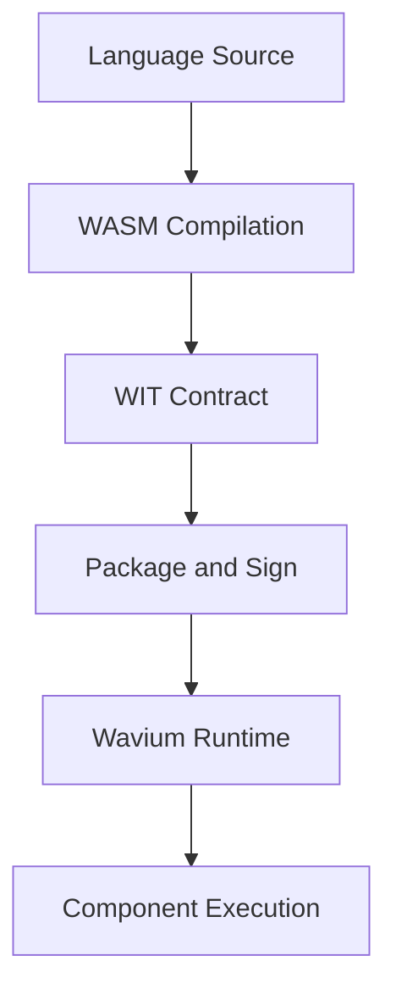

# Component Model

Wavium uses the WebAssembly Component Model as the stable boundary for application and service packaging.

## Why the Component Model

The component model gives Wavium a portable execution unit that can be validated, signed, linked, and deployed without binding the application to a native ABI or an operating system process model.

## Component Properties

Components are:
- portable
- isolated
- capability-aware
- language-neutral
- versionable

## Component Lifecycle

## Runtime Expectations

- a component should declare all stable interfaces in WIT
- a component should not depend on host OS services
- a component should be able to move between targets without changing its contract
- a component should remain understandable as a unit of deployment and isolation

## Relationship To Other Layers

Components should not know whether they are running on bare metal, in a simulator, or on a cloud node. That distinction belongs to the runtime and hardware layers.

The component model sits above the runtime, below the application language, and alongside the WIT contract system.