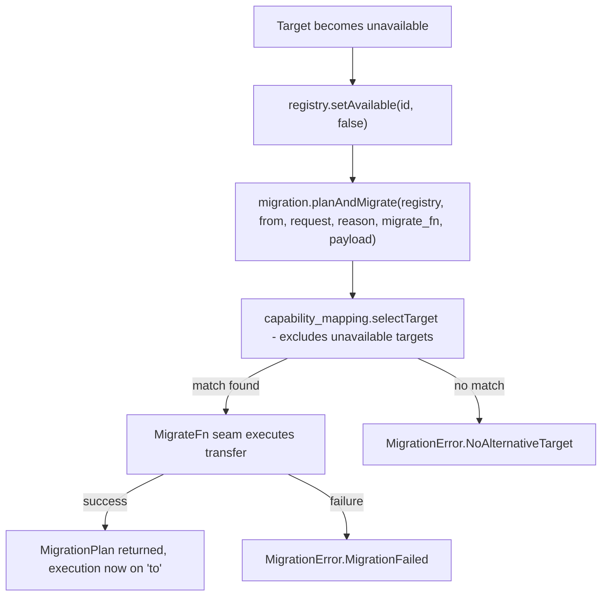

# Execution migration

> Part of the Prompt 30 deliverable ("Future many-core heterogeneous
> architecture"). Implementation: [`modules/wavium-heterogeneous/src/migration.zig`](../../modules/wavium-heterogeneous/src/migration.zig).

## Problem

A computation running on one execution target may need to move to
another target while (or before) it completes:

- the target becomes unavailable (device removed, driver fault,
  power/thermal shutdown);
- a better-suited target is discovered later (a hot-plugged
  accelerator with a stronger capability match);
- the runtime rebalances load across targets;
- a target's advertised capabilities change (e.g. a reconfigurable
  FPGA is reprogrammed and temporarily drops a capability).

Execution migration is the process of re-selecting a target and
transferring execution to it.

## Model

```zig
pub const MigrationReason = enum {
    target_unavailable,
    better_target_discovered,
    load_rebalance,
    capability_downgrade,
};

pub const MigrationPlan = struct {
    from: ExecutionTarget,
    to: ExecutionTarget,
    reason: MigrationReason,
};
```

`planAndMigrate()` re-runs `capability_mapping.selectTarget()` with
the *same* `ComputeRequest` that produced the original placement,
producing a `MigrationPlan`, then invokes the `MigrateFn` seam to
perform the actual state transfer:

```zig
pub const MigrateFn = *const fn (plan: MigrationPlan, payload: *const anyopaque) bool;
```

- `NoAlternativeTarget` is returned if no other registered target
  still satisfies the request (mirrors `capability_mapping`'s hard
  requirement - migration never moves work to a target that can't
  actually do the job).
- `MigrationFailed` is returned if the `MigrateFn` seam itself
  reports failure (e.g. a real backend's checkpoint/restore
  mechanism fails partway through).

## Why a seam, not an implementation

Real state transfer is deeply hardware- and workload-specific:
checkpointing a GPU kernel's device memory looks nothing like
migrating a DPU's in-flight packet-processing pipeline. Per the
prompt's constraint, this phase defines only the **contract**
(`MigrationPlan` in, success/failure out) - a future backend
implements `MigrateFn` however its device requires (serialize state,
drain in-flight work, warm up the new target, then cut over).

## Interaction with discovery and mapping



Migration composes directly with [accelerator discovery](accelerator-discovery.md):
a fresh `discoverAndRegister()` call can add new candidate targets to
the registry before `planAndMigrate()` runs, so a hot-plugged
accelerator can become a migration destination without any change to
the migration logic itself.

## Future extension points

- Proactive migration (moving work *before* a target fails, based on
  health telemetry) can reuse `planAndMigrate()` with
  `better_target_discovered` or `load_rebalance` as the reason.
- Migration policies (e.g. "prefer energy-efficient targets during
  low load") can be layered on top by choosing *when* to call
  `planAndMigrate()`, without changing its contract.
