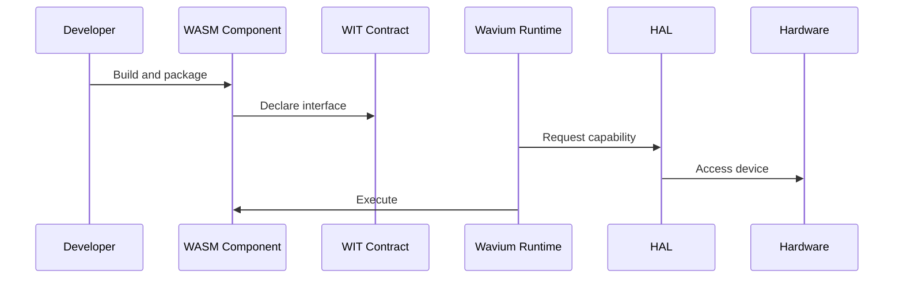

# Execution Model

Wavium execution is component-centric.

The flow is:
1. source code compiles to WASM
2. WIT describes interfaces and worlds
3. packages are signed and verified
4. the runtime loads the component
5. hardware capabilities are granted as needed
6. the component executes under scheduler and memory control

