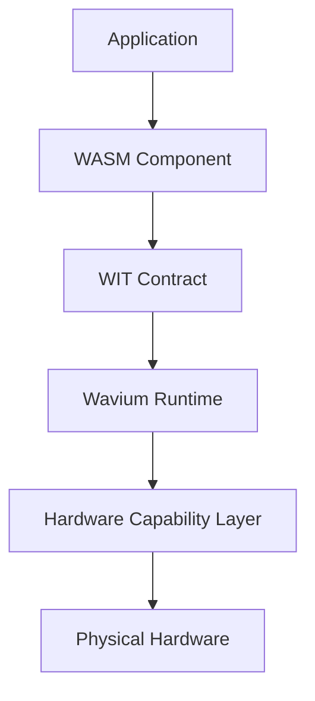

# Architecture Overview

Wavium is organized as a layered platform: applications compile to WebAssembly Components, components communicate through WIT, the runtime enforces capability and memory boundaries, and the hardware layer exposes devices through a first-class HAL.

See:
- [Runtime Architecture](runtime-architecture.md)
- [Component Model](component-model.md)
- [WIT Model](wit-model.md)
- [Hardware Architecture](hardware-architecture.md)
- [Security Model](security-model.md)
- [Execution Model](execution-model.md)