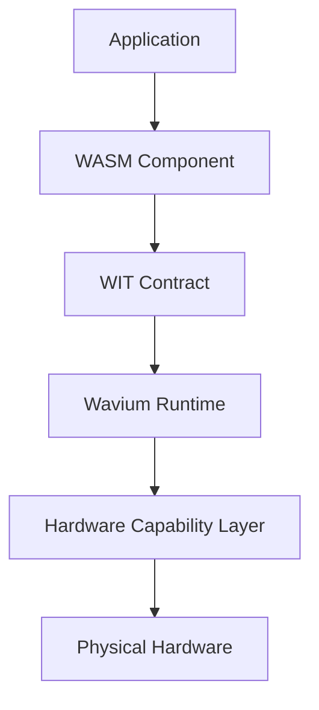

# Architecture Overview

Wavium is organized as a layered platform: applications compile to WebAssembly Components, components communicate through WIT, the runtime enforces capability and memory boundaries, and the hardware layer exposes devices through a first-class HAL.

## Layer Summary

1. Applications
2. WASM Components
3. WIT Interfaces
4. Component Runtime
5. Execution Engine
6. Capability Security
7. Hardware Abstraction
8. Bare Metal Hardware

## Architecture Questions This Page Answers

- What is the stable boundary between application and runtime?
- Where do capabilities live?
- How does hardware become available to a component?
- What must remain deterministic and testable?

See:
- [Runtime Architecture](runtime-architecture.md)
- [Component Model](component-model.md)
- [WIT Model](wit-model.md)
- [Hardware Architecture](hardware-architecture.md)
- [Security Model](security-model.md)
- [Execution Model](execution-model.md)