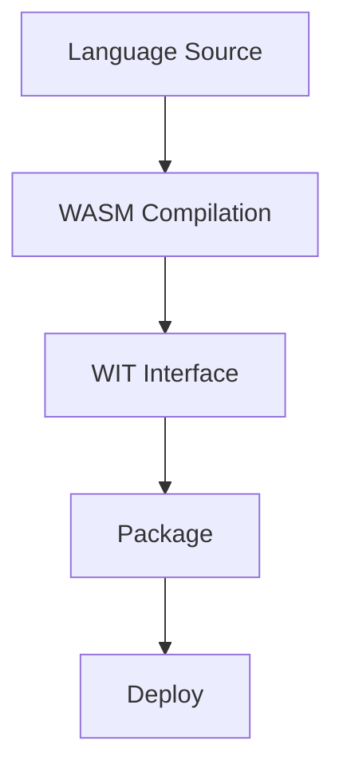

# Create a Component

A Wavium component typically follows this flow:

Language -> WASM compilation -> WIT interface -> package -> deploy

## Component Rules

- keep the component focused on one behavior
- define all public interaction through WIT
- avoid OS-specific APIs inside the component boundary
- treat packaging and signing as part of the delivery model

Components should be kept portable and free of OS assumptions.

## Related Documentation

- [Component Model](../architecture/component-model.md)
- [Write a WIT Interface](write-wit-interface.md)
- [First Component Tutorial](../tutorials/first-component.md)