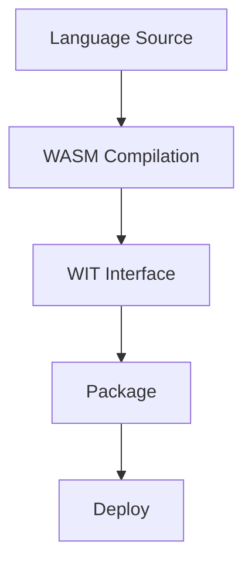

# Create a Component

A Wavium component typically follows this flow:

Language -> WASM compilation -> WIT interface -> package -> deploy

Components should be kept portable and free of OS assumptions.