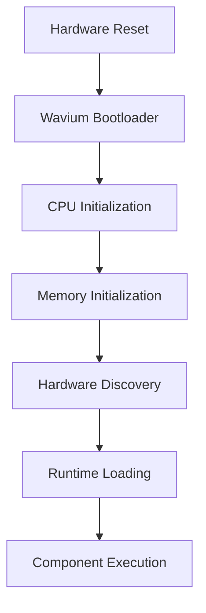

# Bootloader

Wavium boot begins at hardware reset and ends when control is transferred to the runtime loader.

## Responsibilities

- enter from the reset vector
- initialize CPU state and stack memory
- establish the initial memory map
- discover devices and build a hardware manifest
- verify and load the runtime image
- transfer control to the runtime entry point

## Target Classes

- x86_64 bare metal and QEMU
- ARM64 boards and servers
- RISC-V machines and QEMU virt

See [supported platforms](supported-platforms.md) for target coverage.

## Related Documentation

- [Hardware Architecture](../architecture/hardware-architecture.md)
- [Hardware Abstraction](hardware-abstraction.md)
- [Wavium Hardware Spec](../specifications/wavium-hardware-spec.md)
- [Boot Sequence (Prompt 02)](boot-sequence-prompt02.md)
- [Early Memory Map (Prompt 02)](memory-map-prompt02.md)