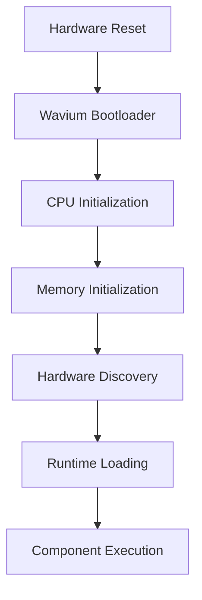

# Bootloader

Wavium boot begins at hardware reset and ends when control is transferred to the runtime loader.

```mermaid
flowchart TD
    Reset[Hardware Reset] --> Boot[Wavium Bootloader]
    Boot --> Cpu[CPU Initialization]
    Cpu --> Mem[Memory Initialization]
    Mem --> Disc[Hardware Discovery]
    Disc --> Load[Runtime Loading]
    Load --> Exec[Component Execution]
```

See [supported platforms](supported-platforms.md) for target coverage.