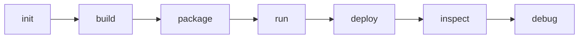

# CLI

Wavium CLI commands are part of the operational interface for building, packaging, running, inspecting, and deploying components.

## Representative Commands

- `wavium init`
- `wavium build`
- `wavium package`
- `wavium run`
- `wavium deploy`
- `wavium inspect`
- `wavium debug`

## Workflow Model

The CLI should remain thin and deterministic, delegating to the build system and runtime contracts instead of embedding ad hoc business logic.

## Related Documentation

- [Build System](build-system.md)
- [Package Format](package-format.md)
- [Command Reference](../reference/command-reference.md)