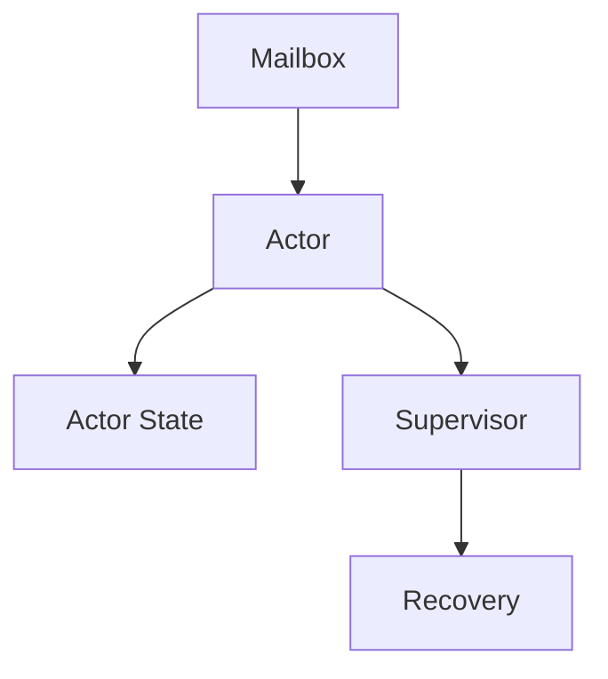

# Actor Example

This tutorial demonstrates a small actor-driven workload that uses a mailbox and supervised lifecycle.

## Prerequisites

- familiarity with the runtime and component docs
- a basic component that can receive messages
- an actor or mailbox abstraction in the runtime layer

## Focus

The example should highlight message boundaries, not shared mutable state.

## Tutorial Flow



1. create one actor with an explicit mailbox
2. define the message shape and processing rules
3. connect the actor to a supervisor
4. inject a few messages and observe transitions
5. verify the actor remains isolated from sibling actors

## Component Source

```zig
const std = @import("std");

pub fn supervise(event: []const u8) []const u8 {
    if (std.mem.eql(u8, event, "restart")) {
        return "actor restarted";
    }
    return "actor observed event";
}

test "supervision handles restart" {
    try std.testing.expectEqualStrings("actor restarted", supervise("restart"));
}
```

## WIT World

```wit
package wavium:actors;

world actor-supervision {
    export supervise: func(event: string) -> string;
}
```

The full working source lives in [examples/actor-supervision](../../examples/actor-supervision).

## Expected Behavior

- messages arrive in a bounded queue
- state changes occur only through message handling
- supervisor policy handles restarts or failures
- no sibling actor directly mutates the actor state

## Learning Outcome

Readers should understand how an actor receives work, transitions state, and remains isolated from sibling actors.

## Related Documentation

- [Actor System](../runtime/actor-system.md)
- [ADR 005: Actor Model Choice](../adr/005-actor-model-choice.md)
- [State Engine](../runtime/state-engine.md)