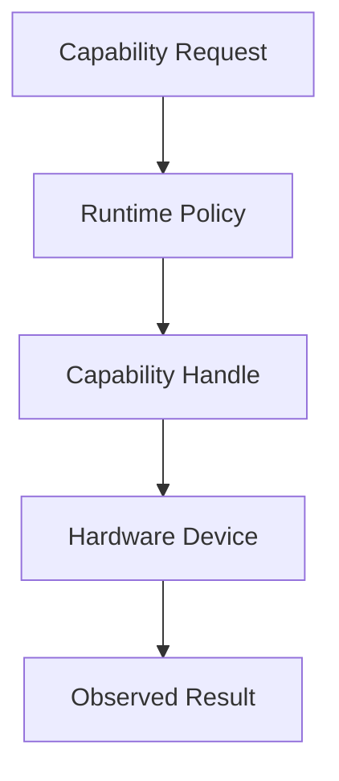

# Hardware Example

This tutorial demonstrates how a component or driver acquires a hardware capability through the runtime and uses it without bypassing the trust model.

## Prerequisites

- understanding of the hardware architecture docs
- a target board or simulator profile
- a component or driver that can request a capability

## Tutorial Flow



1. identify the hardware resource you want to access.
2. request the corresponding capability from the runtime.
3. obtain a safe handle or device descriptor.
4. interact with the device through the approved interface.
5. confirm the component never bypasses the trust model.

## Component Source

```zig
const std = @import("std");

pub fn readSensor(id: u32) []const u8 {
    return switch (id) {
        0 => "temperature=21.5C",
        1 => "humidity=48%",
        else => "sensor unavailable",
    };
}

test "sensor read is stable" {
    try std.testing.expectEqualStrings("temperature=21.5C", readSensor(0));
}
```

## WIT World

```wit
package wavium:sensor;

world edge-device-sensor {
    export read_sensor: func(id: u32) -> string;
}
```

The full working source lives in [examples/edge-device-sensor](../../examples/edge-device-sensor).

## Expected Behavior

- capability acquisition is explicit
- hardware interaction is constrained by policy
- board-aware behavior works without OS dependencies
- runtime ownership remains visible in the access path

## Learning Outcome

You should understand capability acquisition, hardware interaction under policy, and board-aware behavior without OS dependencies.

## Related Documentation

- [Hardware Architecture](../architecture/hardware-architecture.md)
- [Create a Driver](../developers/create-driver.md)
- [Wavium Hardware Spec](../specifications/wavium-hardware-spec.md)