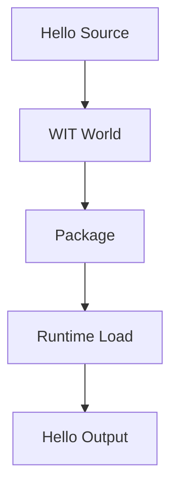

# Hello World

This tutorial shows the smallest Wavium component from source to execution.

## Prerequisites

- a Zig toolchain
- the Wavium repository checkout
- the basic component and WIT docs

## What You Learn

- how a language source file becomes a component
- how the WIT contract defines the boundary
- how the runtime loads and executes the component
- how a minimal package is validated before execution

## Tutorial Flow



1. Start with a single exported function that returns a greeting string.
2. Define a minimal WIT world that names the function and payload types.
3. Package the component so the runtime can resolve its contract.
4. Run the component in the simulator or local runtime.
5. Confirm the output matches the expected greeting.

## Component Source

```zig
const std = @import("std");

pub fn greet() []const u8 {
    return "hello from wavium";
}

test "greet returns a stable message" {
    try std.testing.expectEqualStrings("hello from wavium", greet());
}
```

## WIT World

```wit
package wavium:hello;

world hello-component {
    export greet: func() -> string;
}
```

The full working source lives in [examples/hello-component](../../examples/hello-component).

## Expected Result

The component should load without host OS dependencies and produce a deterministic greeting through the runtime boundary.

The key lesson is that the component is the unit of execution, not a native process.

## Related Documentation

- [First Component](first-component.md)
- [Component Model](../architecture/component-model.md)
- [Create a Component](../developers/create-component.md)