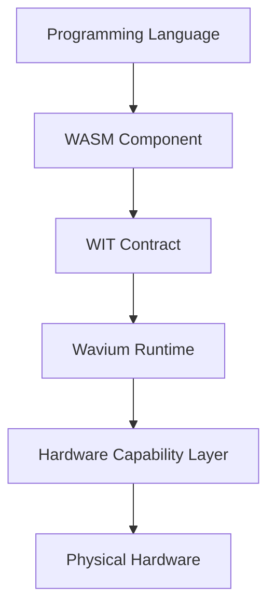

# Future Computing Model

Wavium treats computation as a composition of portable components running through a capability-secured runtime layer.

The future model is:

## What Changes

- applications are described as components rather than processes
- device access is expressed through capabilities rather than ambient OS APIs
- runtime contracts are stable across hardware classes
- build and deployment workflows become contract-driven

## Why It Is Useful

This model supports multi-language development while preserving a single portable execution substrate.

It also keeps platform evolution possible: new target classes can be added by extending the HAL, boot, and discovery layers without rewriting the application model.

## Related Documentation

- [Why Wavium](why-wavium.md)
- [Architecture Overview](../architecture/overview.md)
- [Hardware Architecture](../architecture/hardware-architecture.md)