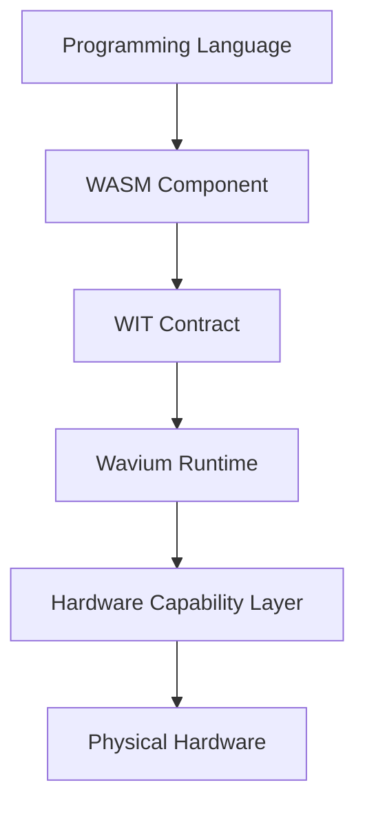

# Future Computing Model

Wavium treats computation as a composition of portable components running through a capability-secured runtime layer.

The future model is:

This model supports multi-language development while preserving a single portable execution substrate.