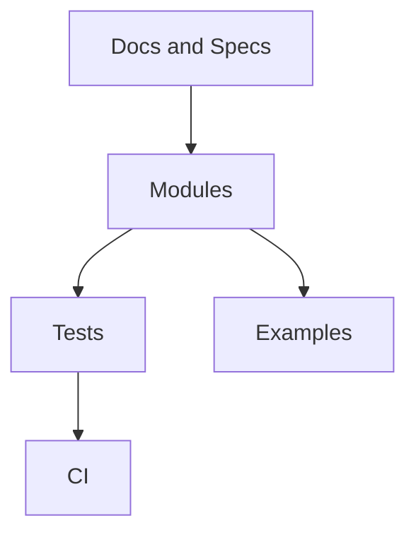

# Wavium Monorepo Architecture Output (Principal-Architect Baseline)

This document is the expected architectural output for the Wavium monorepo.

## 1. Repository Tree

```text
wavium/
  build.zig
  build.zig.zon
  LICENSE
  README.md

  docs/
    wcoe/
      architecture.md
      monorepo-architecture-output.md
      implementation-roadmap.md

  specs/
    was/
      v0.1/
        layers.md
        interfaces.md
        contracts.md
        invariants.md
        threat-model.md

  modules/
    wavium-core/
      build.zig
      src/
        lib.zig
        runtime_context.zig
        lifecycle.zig
        config.zig
        service_registry.zig
      tests/

    wavium-memory/
      build.zig
      src/
        lib.zig
        arena.zig
        region.zig
        quota.zig
        isolation.zig
        snapshot.zig
        zerocopy_buffer.zig
      tests/

    wavium-scheduler/
      build.zig
      src/
        lib.zig
        scheduler.zig
        task.zig
        queue.zig
        priority.zig
        deadline.zig
      tests/

    wavium-fabric/
      build.zig
      src/
        lib.zig
        message.zig
        router.zig
        backpressure.zig
        batching.zig
      tests/

    wavium-security/
      build.zig
      src/
        lib.zig
        capability_token.zig
        permission_set.zig
        resource_handle.zig
        policy.zig
        audit_log.zig
      tests/

    wavium-wasm/
      build.zig
      src/
        lib.zig
        loader.zig
        validator.zig
        engine.zig
        backend/
          interpreter.zig
          jit.zig
          aot.zig
        instance.zig
        isolation.zig
      tests/

    wavium-component/
      build.zig
      src/
        lib.zig
        component_loader.zig
        metadata.zig
        linker.zig
        resolver.zig
        lifecycle.zig
      tests/

    wavium-wit/
      build.zig
      src/
        lib.zig
        parser.zig
        registry.zig
        world_resolver.zig
        abi_canonical.zig
        bindings/
          zig_gen.zig
          rust_gen.zig
          go_gen.zig
          c_gen.zig
          py_gen.zig
          js_gen.zig
      tests/

    wavium-wasi/
      build.zig
      src/
        lib.zig
        clocks.zig
        random.zig
        filesystem.zig
        storage.zig
        environment.zig
        resources.zig
      tests/

    wavium-state/
      build.zig
      src/
        lib.zig
        kv.zig
        actor_state.zig
        snapshot_store.zig
        event_log.zig
        persistence.zig
      tests/

    wavium-actor/
      build.zig
      src/
        lib.zig
        actor.zig
        mailbox.zig
        supervisor.zig
        migration.zig
        runtime_adapter.zig
      tests/

    wavium-hal/
      build.zig
      src/
        lib.zig
        cpu.zig
        memory_bus.zig
        storage_bus.zig
        gpu.zig
        network.zig
        device_registry.zig
      tests/

    wavium-federation/
      build.zig
      src/
        lib.zig
        discovery.zig
        migration.zig
        state_transfer.zig
        distributed_scheduler.zig
      tests/

    wavium-cli/
      build.zig
      src/
        main.zig
        commands/
          create.zig
          build.zig
          package.zig
          run.zig
          inspect.zig
          debug.zig
          benchmark.zig

    wavium-sdk/
      build.zig
      src/
        lib.zig
        generator.zig
        templates/
      tests/

  examples/
    hello-component/
    binary-rpc-replacement/
    actor-supervision/
    ai-agent-component/
    edge-device-sensor/
    gpu-exec/

  tests/
    unit/
    component/
    abi/
    fuzz/
    stress/
    integration/

  benchmarks/
    startup/
    memory/
    density/
    messaging/
    throughput/
    latency/
    energy/
    harness/
```

## 2. Module Responsibilities
- wavium-core: runtime composition root, lifecycle, configuration, service registration.
- wavium-memory: deterministic allocation and memory isolation with quotas and snapshots.
- wavium-scheduler: cooperative execution, priority/deadline queues, and dispatch loops.
- wavium-fabric: binary message model, routing, backpressure, batching, and transport adapters.
- wavium-security: capability issuance, validation, policy checks, and security audit events.
- wavium-wasm: core module loading/validation and backend abstraction (interp/JIT/AOT).
- wavium-component: component model lifecycle, linking, dependency and world resolution hooks.
- wavium-wit: WIT parser and canonical ABI mapping plus polyglot SDK generators.
- wavium-wasi: runtime-owned WASI-like host functions without POSIX emulation.
- wavium-state: local embedded state and append-only event persistence primitives.
- wavium-actor: actor abstraction, mailboxing, supervision, migration hooks.
- wavium-hal: hardware-facing abstractions and driver-safe interfaces.
- wavium-federation: multi-node discovery, transfer, and scheduling coordination.
- wavium-cli: developer workflows (create/build/package/run/inspect/debug/benchmark).
- wavium-sdk: generated client/server interfaces from WIT contracts.

## 3. Dependency Graph (High Level)
- wavium-core depends on: wavium-memory, wavium-scheduler, wavium-security, wavium-fabric.
- wavium-wasm depends on: wavium-memory, wavium-security.
- wavium-component depends on: wavium-wasm, wavium-wit, wavium-security.
- wavium-wasi depends on: wavium-security, wavium-state, wavium-hal.
- wavium-actor depends on: wavium-scheduler, wavium-fabric, wavium-state, wavium-component.
- wavium-state depends on: wavium-memory, wavium-security.
- wavium-federation depends on: wavium-actor, wavium-state, wavium-fabric, wavium-security.
- wavium-cli depends on: wavium-component, wavium-wit, wavium-sdk.
- wavium-sdk depends on: wavium-wit.

Design rule:
- Dependency direction must always point toward lower-level, more-stable contracts.
- No upward dependency from foundational layers into orchestration layers.

## 4. Build Architecture (Zig)
- Root build orchestrates module build targets and test targets.
- Each module owns its own build.zig and exposes a stable lib target.
- build.zig.zon pins third-party packages used only where justified.
- Cross-target profiles:
  - host-debug
  - host-release-fast
  - baremetal-release-small
- Feature flags via comptime config:
  - enable_jit
  - enable_aot
  - enable_federation
  - enable_gpu

## 5. Public Module APIs (Contract Sketch)
- wavium-core:
  - init(config: RuntimeConfig) -> RuntimeContext
  - start(ctx: *RuntimeContext) -> void
  - shutdown(ctx: *RuntimeContext) -> void
- wavium-wasm:
  - load(bytes: []const u8) -> WasmModule
  - instantiate(module: *WasmModule, opts: InstanceOptions) -> Instance
  - execute(inst: *Instance, entry: []const u8, args: []const u8) -> ExecResult
- wavium-component:
  - loadComponent(pkg: ComponentPackage) -> Component
  - link(component: *Component, world: WorldSpec) -> LinkedComponent
- wavium-wit:
  - parse(path: []const u8) -> WitPackage
  - generate(pkg: *WitPackage, lang: TargetLanguage) -> GeneratedSdk
- wavium-security:
  - issue(subject: SubjectId, perms: PermissionSet) -> CapabilityToken
  - authorize(token: CapabilityToken, action: Action) -> bool

## 6. Architecture Boundaries
- Boundary A (Execution): wavium-wasm and wavium-component own instance correctness.
- Boundary B (Isolation): wavium-memory and wavium-security enforce all access guards.
- Boundary C (Concurrency): wavium-scheduler and wavium-actor own execution progression.
- Boundary D (Persistence): wavium-state owns durability and replay semantics.
- Boundary E (Hardware): wavium-hal is sole path to device-level resource mediation.
- Boundary F (Tooling): wavium-cli/wavium-sdk may orchestrate but must not bypass core contracts.

## 7. Testing Strategy
- Unit tests inside each module tests/.
- Contract tests for public APIs in tests/component/.
- ABI tests for canonical ABI and WIT mappings in tests/abi/.
- Fuzz tests on parsers, message framing, capability token parsing.
- Stress tests for scheduler, mailbox, and routing queues.
- Determinism tests for memory allocators and snapshot replay.

## 8. Benchmark Structure
- startup/: cold and warm component startup.
- memory/: allocation latency, fragmentation resistance, quota behavior.
- messaging/: throughput, p99 latency, backpressure response.
- density/: max runnable components per memory budget.
- energy/: joules per million operations.

## 9. Documentation Structure
- specs/was/v0.1/layers.md: runtime layer contracts.
- specs/was/v0.1/interfaces.md: inter-module APIs and ownership rules.
- specs/was/v0.1/contracts.md: invariants and failure semantics.
- specs/was/v0.1/invariants.md: hard guarantees (safety/perf/isolation).
- specs/was/v0.1/threat-model.md: attack model and mitigations.
- docs/wcoe/implementation-roadmap.md: milestone and execution plan.

## 10. Recommended Development Order
1. wavium-core + wavium-memory foundations.
2. wavium-scheduler + wavium-fabric event path.
3. wavium-security capability checks.
4. wavium-wasm base interpreter path.
5. wavium-component + wavium-wit minimal end-to-end component load.
6. wavium-actor runtime and supervision basics.
7. wavium-state snapshots and replay.
8. wavium-wasi host capability surface.
9. wavium-cli and wavium-sdk first usable workflows.
10. wavium-federation and advanced backends (JIT/AOT).

## 11. Architectural Intent

This repository tree is intended to make the platform understandable from the top down:
- docs define the contract
- specs define the invariants
- modules implement the runtime and tooling
- examples teach the programming model
- tests validate the expected behavior

## 12. Documentation Expectations

Every major subsystem should have:
- an architecture page
- a specification page
- at least one tutorial or example
- relevant ADR coverage when the design is opinionated

## 13. Diagram Summary


