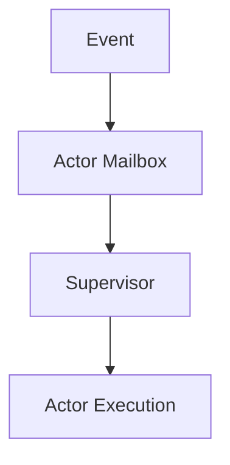

# Actor Supervision Example

This example shows the shape of a supervised actor workload in Wavium.

It focuses on mailbox-driven communication, explicit lifecycle transitions, and replay-friendly behavior.

## What It Proves

- actor state is isolated from other execution units
- supervision is explicit and event-driven
- lifecycle changes are represented as messages, not hidden state

## Scenario

An actor receives an event and decides whether it should restart or continue running.

## Runtime Model

