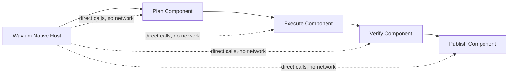

# AI Agent Component Example

This example starts the implementation of an end-to-end Wavium demo that keeps service communication native instead of routing through HTTP, JSON, or any other network protocol.

The current slice establishes the contract-first workflow boundary: a host orchestrates direct component calls, and each role can be implemented in a different language as long as it speaks the same WIT surface.

## What It Proves

- the runtime can coordinate a multi-step workflow without network hops
- service boundaries stay explicit through WIT instead of a transport protocol
- the same workflow contract can be implemented by components written in different languages
- workflow state remains small, deterministic, and inspectable

## Demo Shape

plan -> execute -> verify -> publish

## Native Execution Model

## Files

- component.wit: contract for the workflow stages
- src/main.zig: deterministic Zig implementation of the workflow steps and native host transcript
- rust/src/lib.rs: Rust component variant with the same contract and tests
- js/index.js: JavaScript component variant with the same contract and tests

## Implementation Notes

This slice keeps the first implementation narrow on purpose.

- the component contract is still string-based so the example stays easy to read
- the next slices can add matching Rust, JavaScript, or other language components against the same WIT contract
- the host-side orchestration can remain native while each service stays a standalone WASM component

## Host Flow

The Zig example now includes a small native host path that loads explicit workflow components, validates the shared world, and runs the full workflow in order:

1. plan
2. execute
3. verify
4. publish

That is the current end-to-end entrypoint for the demo and the place to extend when swapping in compiled WASM component artifacts later.

## Language Parity

The example now has three language-specific component implementations that all answer the same workflow stages, and the Zig host loads those roles as runtime component descriptors:

- Zig host slice in `src/main.zig`
- Rust component slice in `rust/src/lib.rs`
- JavaScript component slice in `js/index.js`

That keeps the demo focused on WIT compatibility and native composition rather than on transport plumbing.