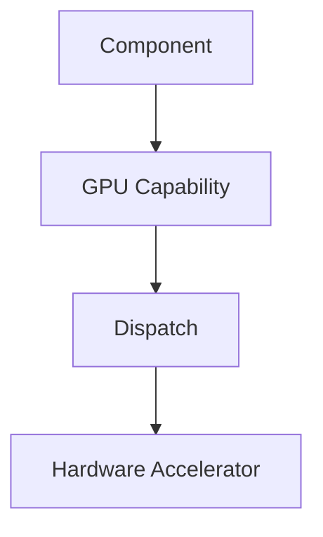

# GPU Execution Example

This example represents a hardware-capability-backed compute workload.

The purpose is to show that GPU access in Wavium is modeled as a capability and not as a direct OS-level API.

## What It Proves

- accelerator access is mediated by the runtime
- compute dispatch can be modeled as a capability
- the same abstraction can extend to other accelerators

## Runtime Model

