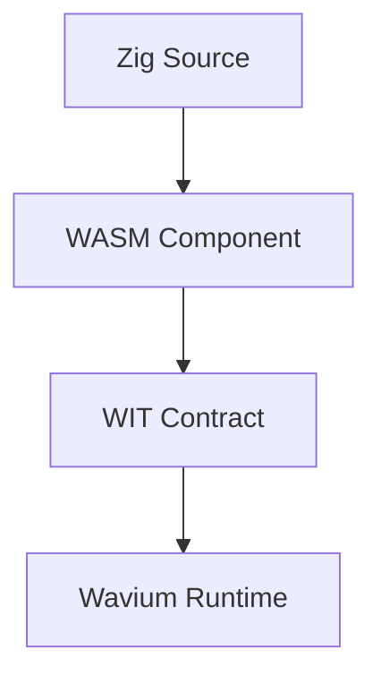

# Hello Component

A minimal component example that demonstrates the smallest Wavium unit of execution.

## Goal

Show how language code becomes a portable WASM component with a WIT contract and a deterministic runtime boundary.

## What It Proves

- component-first execution is the application model
- the stable interface is WIT, not a native ABI
- the runtime can host a trivial component without OS assumptions

## Files

- `component.wit`: interface contract for the hello component
- `src/main.zig`: small Zig component entry example

## Runtime Model

## Expected Output

The example returns a stable greeting string, which makes it easy to use in docs, tests, and generated SDK discussions.